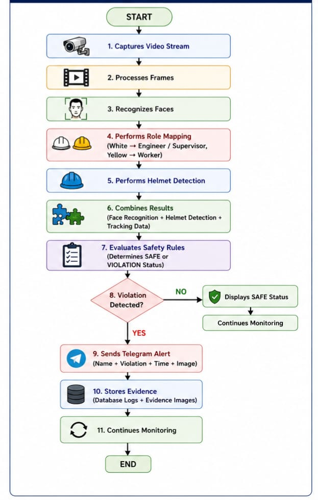
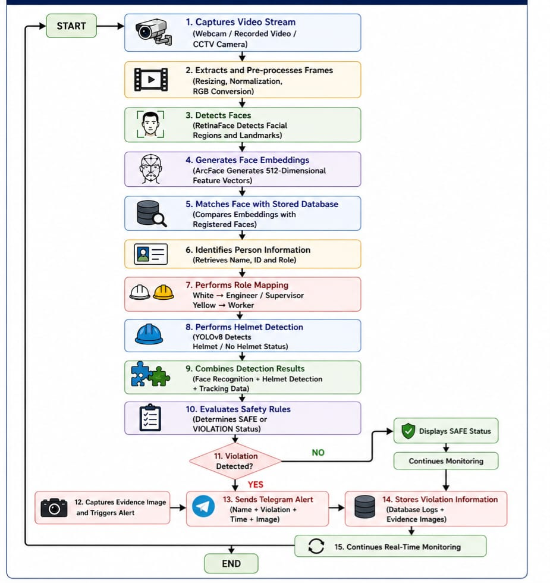

# Vision-Based AI Safety Helmet (PPE) Detection System for Construction Sites

This project develops a Vision-Based AI Safety Helmet Detection System for construction sites. It combines YOLOv8 for helmet detection, InsightFace for worker identification, GPS/GSM for location and SMS alerts, Telegram notifications, LEDs, and voice warnings to provide real-time safety monitoring and violation reporting.

## How it works

1. Capture a video stream (webcam, recorded video or CCTV).
2. Detect helmets with YOLOv8 and classify helmet colour (HSV): **White → Engineer/Supervisor**, **Yellow → Worker**.
3. Detect and recognise faces with InsightFace (RetinaFace + ArcFace 512-d embeddings) against a registered face database.
4. Match each face to a nearby helmet to decide **SAFE** or **NO HELMET**.
5. On a violation: save an evidence image, log it to CSV, and send a Telegram alert (name, violation, time, image).
6. Helmeted workers show live GPS coordinates streamed from the ESP8266 helmet.




## Main scripts (`src/`)

| Script | Purpose |
|---|---|
| `HDRA With GPS.py` | Final webcam system: detection, recognition, role mapping, alerts, logging, live GPS from helmet over Wi-Fi |
| `HDRA Video with GPS.py` | Same as above, run on a recorded video |
| `HDRGA Webcam/Video Faster+Adaptive Color Logic.py` | Optimised pipeline (inference every 3rd frame, adaptive colour logic) |
| `gps.py` | Standalone receiver for the ESP8266 GPS stream |
| `build_database.py` | Builds `face_db.npy` from a `faces/<person>/` image folder |
| `Insightface Stand Alone.py`, `Role Mapping Isolation.py` | Isolated tests of face recognition and helmet role mapping |
| `Dashboard+ Cyrus.py`, `cctv.py` | PyQt5 dashboards |
| `Plus Sound*.py` | Voice warning variants (pyttsx3) |
| `Recognition+Helmet+Color+sms.py` | SMS alerts via Africa's Talking |

Other files are earlier development iterations.

## Setup

```bash
pip install ultralytics insightface onnxruntime opencv-python numpy requests flask pyqt5 pyttsx3 africastalking
```

Credentials are read from environment variables:

| Variable | Used for |
|---|---|
| `TELEGRAM_BOT_TOKEN`, `TELEGRAM_CHAT_ID` | Telegram alerts |
| `AT_API_KEY`, `ALERT_PHONE_NUMBER` | Africa's Talking SMS alerts |

Model weights (`best.pt`), the InsightFace `buffalo_l` models, `face_db.npy`, face images and test videos are not included in the repo. Update the hardcoded `F:/Documents/...` paths in the scripts to match your machine.
